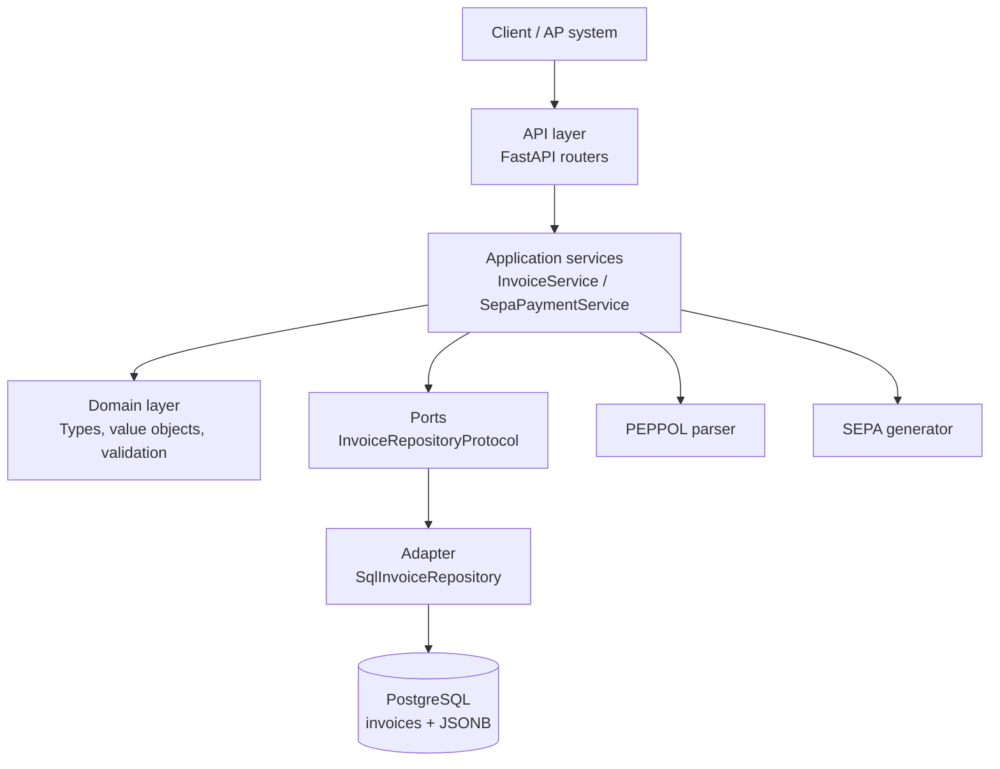

# Universal Invoice Engine

Backend API for European accounts payable automation: ingest PEPPOL invoices, normalize them into canonical data, prevent duplicate ingestion, and generate SEPA `pain.001` payment XML.

This is intentionally a focused backend engine, not a full ERP or accounting SaaS.

## What It Solves

Finance teams receive invoices from multiple sources and need a reliable path from document intake to payment preparation:

```text
Invoice upload
-> PEPPOL parsing
-> Canonical invoice data
-> PostgreSQL persistence
-> Duplicate protection
-> SEPA payment generation
```

## Implemented Scope

- `POST /api/v1/ap/invoices/ingest` for invoice ingestion
- PEPPOL/UBL XML parsing into a canonical invoice model
- PostgreSQL persistence with JSONB `canonical_data`
- SHA-256 raw file hash for idempotency
- Unique database constraint on `raw_hash`
- SEPA `pain.001.001.03` XML generation from stored invoice data
- IBAN validation and normalization
- Alembic migration setup with an initial `invoices` table migration
- FastAPI error handling for duplicate, invalid, unsupported, and missing invoice cases

## Architecture

The project uses a modular monolith with a practical ports-and-adapters boundary.



### Key Decisions

- **Modular monolith over microservices**: simpler deployment and debugging for an MVP while keeping clear internal boundaries.
- **Thin routers**: HTTP code delegates workflow decisions to services.
- **Repository port**: services depend on `InvoiceRepositoryProtocol`, not directly on SQLAlchemy.
- **Database-backed idempotency**: duplicate protection is enforced by PostgreSQL, not only by an application pre-check.
- **JSONB canonical payload**: flexible enough for evolving invoice formats without over-modeling every field on day one.
- **Alembic migrations**: schema evolution is versioned and demonstrable.

## End-to-End Flow

### Invoice Ingestion

```text
Upload file
-> validate filename, extension, and size
-> compute SHA-256 hash
-> parse PEPPOL XML
-> build canonical_data
-> insert invoice
-> return invoice_id and parsed invoice data
```

If the same raw file is uploaded again, the unique `raw_hash` constraint triggers a domain-level duplicate response.

### SEPA Generation

```text
Receive invoice_id + debtor account
-> load invoice from repository
-> validate canonical_data
-> validate creditor IBAN
-> generate ISO 20022 pain.001 XML
-> return payment payload
```

## Local Development

Start PostgreSQL:

```bash
docker-compose up -d postgres
```

Apply migrations:

```bash
uv run alembic upgrade head
```

Run the API:

```bash
uv run uvicorn src.api.main:app --reload
```

Run checks:

```bash
uv run ruff check .
uv run pytest
uv run alembic check
```

## Useful Demo Commands

Health check:

```bash
curl http://127.0.0.1:8000/api/v1/health
```

Ingest an invoice:

```bash
curl -X POST http://127.0.0.1:8000/api/v1/ap/invoices/ingest \
  -H "X-API-Key: demo-api-key" \
  -F "file=@/tmp/invoice.xml"
```

Generate SEPA:

```bash
curl -X POST http://127.0.0.1:8000/api/v1/ap/payments/sepa/generate \
  -H "X-API-Key: demo-api-key" \
  -H "Content-Type: application/json" \
  -d '{
    "invoice_id": "<invoice_id>",
    "debtor_name": "My Company S.L.",
    "debtor_iban": "ES7921000813610123456789",
    "debtor_bic": "BBVAESMM",
    "requested_execution_date": "2026-06-15"
  }'
```

## Tradeoffs

- Processing is synchronous for MVP clarity.
- Authentication is intentionally a placeholder API-key dependency.
- There is no dashboard, tenant model, OCR pipeline, or full ERP accounting module.
- PEPPOL parsing is implemented for the current tested invoice shape, not every jurisdiction-specific validation rule.

## Production Evolution

The next production-oriented steps would be:

- background jobs for heavier parsing workloads
- explicit invoice workflow states and audit events
- stronger API key management or OAuth2/JWT
- tenant isolation
- deeper PEPPOL/EN16931 compliance validation
- object storage for raw invoice files

## Documentation

- `docs/architecture.md` - system layers, flows, and design rationale
- `DEMO_GUIDE.md` - short walkthrough for presenting the project
