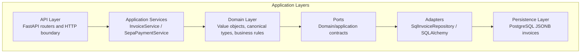
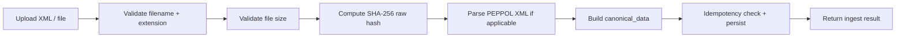
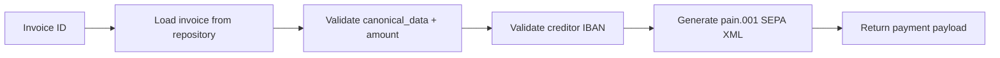

# Architecture of Universal Invoice Engine

## Overview

Universal Invoice Engine is an API-first backend designed to automate invoice ingestion and SEPA payment generation for European AP workflows.

This document describes:

- architectural layers
- request → domain → persistence flow
- ports and adapters
- value objects
- idempotency
- canonical invoice ingestion
- SEPA generation
- service separation
- AI-native readiness
- design tradeoffs

## Architectural Style

The system follows a modular monolith architecture:

- clear bounded responsibilities
- isolated application services
- domain-oriented modules
- a single deployable unit

This keeps operational complexity low while preserving scalability paths.

## Layers

### Layer responsibilities

- **API Layer**: thin HTTP boundary with request validation and response serialization.
- **Application Services**: orchestrate business workflows without infrastructure details.
- **Domain Layer**: contains business rules, canonical models and validations.
- **Ports**: define the contracts required by the application and domain layers.
- **Adapters**: provide infrastructure-specific implementations for those contracts.
- **Persistence Layer**: stores invoices and canonical payloads in PostgreSQL/JSONB.

## Bounded contexts

The system implicitly models the following bounded contexts:

- Invoice ingestion
- Payment generation
- Validation
- Persistence

## Ingestion flow

### Ingestion details

1. `POST /api/v1/ap/invoices/ingest` receives the uploaded file.
2. `InvoiceService.ingest` validates filename, extension, and size.
3. The raw file content is hashed with SHA-256 for idempotency.
4. If the file is `.xml`, it is parsed as PEPPOL BIS 3.0.
5. `canonical_data` is built from parsed invoice values or minimal metadata.
6. The invoice is persisted with a unique `raw_hash`.
7. If the same hash already exists, the repository raises `DuplicateInvoiceError`.

## SEPA payment flow

### Payment details

1. `POST /api/v1/ap/payments/sepa/generate` receives the payment request.
2. `SepaPaymentService.generate_sepa` loads the invoice by `invoice_id`.
3. The service validates `canonical_data`, `total_amount` and `creditor_iban`.
4. `IBAN` is a value object that validates and normalizes bank account data.
5. If valid, the service generates ISO 20022 `pain.001.001.03` XML.

## Ports and adapters

- `InvoiceRepositoryProtocol` is the domain/application contract.
- `SqlInvoiceRepository` is the infrastructure adapter that implements it.
- Ports belong to the domain/application side.
- Adapters belong to the infrastructure side.

This is a practical hexagonal architecture: application logic depends on abstractions, not on SQLAlchemy directly.

## Why JSONB?

The invoice data model stores canonical invoice payloads in `canonical_data` as JSONB.

This was chosen because:

- invoices vary significantly by source
- canonical schemas evolve over time
- PEPPOL and custom formats can diverge
- JSONB enables flexible ingestion without destructive migrations

It supports a stable persistence contract while allowing the canonical data shape to grow.

## Value objects

### `IBAN`

- defined in `src/domain/value_objects/iban.py`
- validates IBAN format with `stdnum`
- normalizes spacing and casing
- protects payment generation with a strict bank account contract

### `canonical_data`

- canonical JSON representation of invoice metadata
- designed to be:
  - consistent
  - auditable
  - consumable by downstream systems
  - suitable for AI ingestion pipelines
- common fields: `invoice_id`, `supplier_name`, `customer_name`, `total_amount`, `creditor_iban`, `currency`

## Idempotency

Idempotency is enforced using `raw_hash`:

- SHA-256 of the raw uploaded bytes is computed in `InvoiceService._compute_hash`
- `raw_hash` is unique in the `invoices` table
- database integrity failure is translated to `DuplicateInvoiceError`

This makes duplicates a database-level guarantee rather than a race-prone application check.

## Why separate `InvoiceService` and `SepaPaymentService`?

- `InvoiceService` handles ingestion, validation and canonicalization.
- `SepaPaymentService` handles invoice loading, payment validation and SEPA generation.
- Separation of concerns reduces coupling and gives each service a single reason to change.
- It enables smaller unit tests and clearer extension paths (OCR, multi-payment rails, payment rules).

## Design tradeoffs

- Simplicity over premature distribution
- Modular monolith over microservices
- JSONB flexibility over rigid schema enforcement
- Explicit domain services over fat routers
- Synchronous processing for MVP simplicity

## What this system solves

- secure invoice ingestion for European B2B workflows
- early validation of format, size and invoice structure
- canonicalization of PEPPOL and mixed invoice sources
- SEPA payment file generation for downstream banking systems
- a clean path from document to executed payment intent

## AI-native readiness

The system is designed for AI-native finance operations because:

- `canonical_data` is normalized and structured
- the ingestion boundary produces consistent financial objects
- downstream AI workflows can consume a stable schema
- separation of ingestion and persistence enables enrichment before payment

> In an AI-fintech pipeline, `canonical_data` is the junction where heterogeneous invoices become downstream-ready financial objects.

## Roadmap

- async ingestion queue for non-XML sources and file processing
- OCR + extraction for PDFs and unstructured invoices
- vendor enrichment and normalization with AI
- anomaly detection for suspicious invoices
- entity deduplication and supplier normalization
- stateful orchestration for multi-stage payment flows
