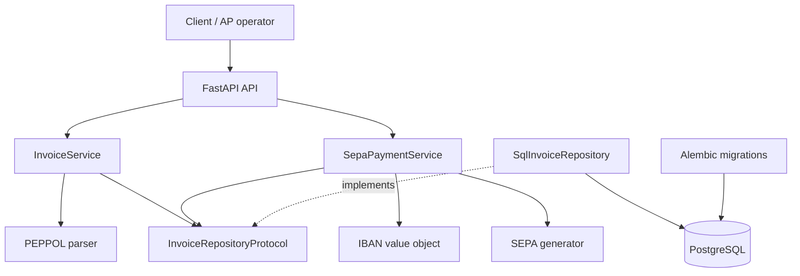
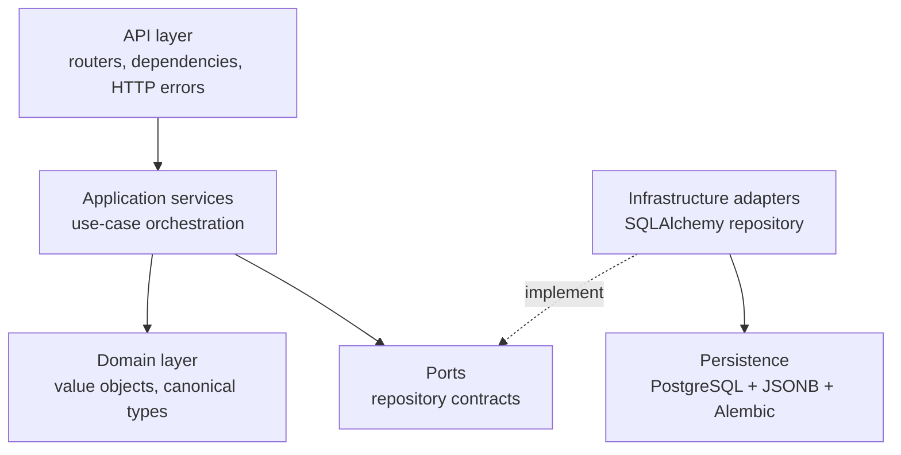
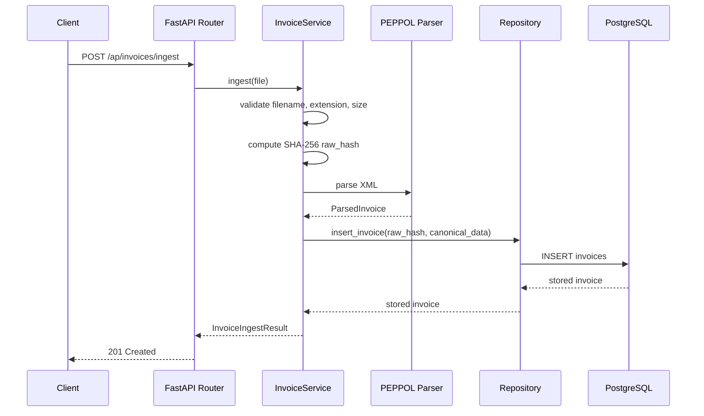
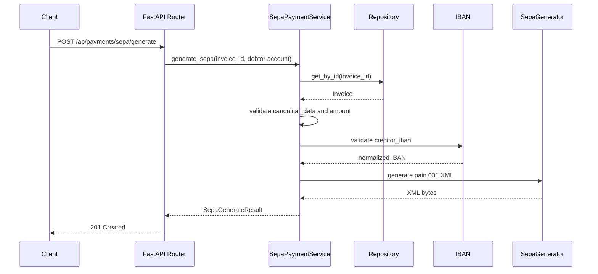

# Architecture

Universal Invoice Engine is a focused backend engine for European AP automation. It ingests invoices, extracts canonical data, stores that data idempotently, and generates SEPA payment XML.

It is not a full accounting platform. It is the backend engine that could sit inside one.

## System Boundary



## Layers



### API Layer

- owns HTTP routes, request parsing, and response models
- keeps business rules out of routers
- translates domain exceptions into HTTP responses

### Application Services

- `InvoiceService` handles ingestion, validation, parsing, canonicalization, and persistence
- `SepaPaymentService` loads stored invoice data and generates payment XML
- services coordinate workflows but avoid direct SQLAlchemy calls

### Domain

- `InvoiceRepositoryProtocol` defines the persistence contract needed by services
- `IBAN` validates and normalizes account numbers before payment generation
- canonical invoice data provides a stable shape for downstream workflows

### Adapters and Persistence

- `SqlInvoiceRepository` adapts the repository protocol to SQLAlchemy
- `Invoice` is the PostgreSQL model
- `canonical_data` is stored as JSONB
- Alembic owns schema migrations

## Ingestion Flow



Duplicate uploads are rejected by the unique `raw_hash` constraint. The repository translates that database conflict into a repository error, and `InvoiceService` translates it into a service-level duplicate error.

## SEPA Flow



## Idempotency

Idempotency is enforced with two layers:

- application layer computes `raw_hash = sha256(raw_bytes)`
- database layer enforces a unique index on `invoices.raw_hash`

The database is the source of truth. This avoids race-prone duplicate checks when multiple API instances exist.

## Schema Management

Alembic tracks schema evolution. The initial migration creates:

- `invoices.id`
- `invoices.raw_hash`
- `invoices.filename`
- `invoices.source_format`
- `invoices.canonical_data`
- `invoices.status`
- timestamps
- unique index on `raw_hash`

Useful commands:

```bash
uv run alembic upgrade head
uv run alembic current
uv run alembic check
```

## Design Tradeoffs

- **Synchronous processing** keeps the MVP simple, but heavy PDF/OCR parsing should move to background jobs.
- **JSONB canonical data** avoids premature schema rigidity, but important query fields may eventually deserve dedicated columns.
- **API key placeholder** is enough for local demo, but production needs real key management or OAuth2/JWT.
- **Single deployable service** is easier to operate now; clear boundaries make future extraction possible if volume requires it.

## Production Evolution

The most natural next steps are:

1. invoice status workflow and audit events
2. background workers for heavy parsing
3. tenant-aware API keys and data isolation
4. stricter PEPPOL/EN16931 compliance checks
5. raw file storage outside the relational database
